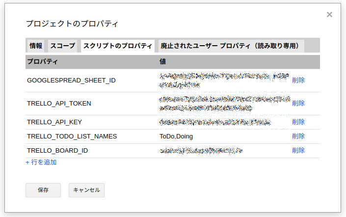

 gas-trello-point-to-spreadsheet
===============================

## What's this ?

Trelloの一つのボードのいくつかのリストからポイントを抜き出し、GoogelSpreadSheetの特定セルに記入するGoogle Apps Script(GAS)。

## Prerequisites

- [導入時に「すでにあるはずのもの」の前提](./doc/PREREQUISITES.md)

### ローカル環境

- npm 導入済み

## Usage

### 事前準備

1. GoogleDriveに「Google Apps Script」を作成
    - 名前を「無題のプロジェクト」から変更しておく
0. [「プロジェクトのプロパティ」を設定](./#%E3%83%97%E3%83%AD%E3%82%B8%E3%82%A7%E3%82%AF%E3%83%88%E3%81%AE%E3%83%97%E3%83%AD%E3%83%91%E3%83%86%E3%82%A3%E3%82%92%E8%A8%AD%E5%AE%9A
)

#### 「プロジェクトのプロパティ」を設定

GASのメニューから「ファイル」>「プロジェクトのプロパティ」を開き、「スクリプトのプロパティ」タブを開く。

値を追加できるので、以下を入力する。

- `TRELLO_API_KEY` : [TrelloのWebAPIが操作可能なキー](#Trello%E3%81%AE%E3%80%8CAPI%E3%82%AD%E3%83%BC%E3%80%8D%E3%81%A8%E3%80%8CAPI%E3%83%88%E3%83%BC%E3%82%AF%E3%83%B3%E3%80%8D%E3%81%A8%E3%80%8C%E3%83%9C%E3%83%BC%E3%83%89%E3%81%AEID%E3%80%8D%E3%81%AE%E8%AA%BF%E3%81%B9%E3%81%8B%E3%81%9F)
- `TRELLO_API_TOKEN` : [TrelloのWebAPIが操作可能なトークン](#Trello%E3%81%AE%E3%80%8CAPI%E3%82%AD%E3%83%BC%E3%80%8D%E3%81%A8%E3%80%8CAPI%E3%83%88%E3%83%BC%E3%82%AF%E3%83%B3%E3%80%8D%E3%81%A8%E3%80%8C%E3%83%9C%E3%83%BC%E3%83%89%E3%81%AEID%E3%80%8D%E3%81%AE%E8%AA%BF%E3%81%B9%E3%81%8B%E3%81%9F)
- `TRELLO_BOARD_ID` : ポイントの集計対象とする[ボードのID(非ボード名)](#Trello%E3%81%AE%E3%80%8CAPI%E3%82%AD%E3%83%BC%E3%80%8D%E3%81%A8%E3%80%8CAPI%E3%83%88%E3%83%BC%E3%82%AF%E3%83%B3%E3%80%8D%E3%81%A8%E3%80%8C%E3%83%9C%E3%83%BC%E3%83%89%E3%81%AEID%E3%80%8D%E3%81%AE%E8%AA%BF%E3%81%B9%E3%81%8B%E3%81%9F)
- `TRELLO_TODO_LIST_NAMES` : ポイントの集計対象とするリストの名前(こちらはリストの名前) カンマ区切りで複数指定可能
- `GOOGLESPREAD_SHEET_ID` : 記入対象のGoogleSpreadSheetのID(編集画面の `https://docs.google.com/spreadsheets/d/` の後ろの文字列)

#### Trelloの「APIキー」と「APIトークン」と「ボードのID」の調べかた

[こちら(自身のブログの過去記事)](https://kazuhito-m.github.io/tech/2015/11/02/mindmeister2trello-importer) の中程を参考に。

### Deploy

## Auther

[@kazuhito_m](https://twitter.com/kazuhito_m)
