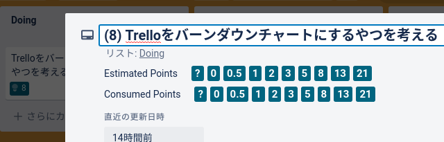
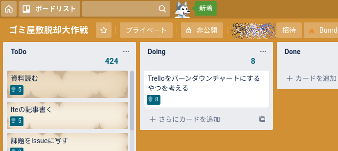
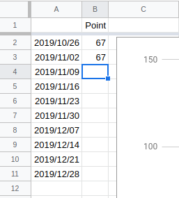

導入時に「すでにあるはずのもの」の前提
=======

- Trelloにアカウントを持っており、対処となるボードはそのアカウントで閲覧・操作が可能である
- Googleアカウントを持っており、対象となるSpreadSheetはそのアカウントで閲覧・操作が可能である

## 対象となるTrelloボードの形式

###  ポイントの数え方

「Scrum for Trello([Chrome](https://chrome.google.com/webstore/detail/scrum-for-trello/jdbcdblgjdpmfninkoogcfpnkjmndgje)/FrieFoxのブラウザ拡張)」形式での「カードタイトル入力形式」を前提とする。

具体的には「カードタイトルに括弧付きで記入された数値」を集計する。

### 対象のリスト

集計対象のリストは、設定により複数指定することが出来る。

上記の例では「 `ToDo` と `Doing` を集計対象」のような指定が出来るが「 `Done` の一部だけ集計」などは指定できない。

## 対象と成るGoogle SpreadSheetの形式

2行目から、

- 1列目: 日付
- 2列目: ポイント

と定義したSpreadSheetを用意する。
